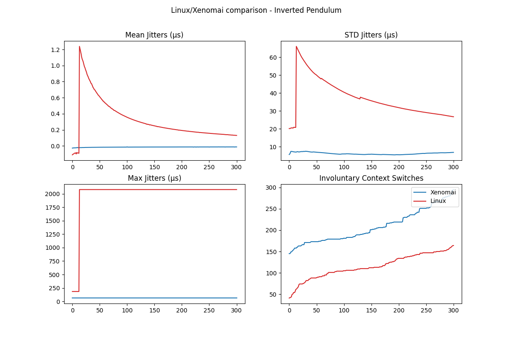

[![Say Thanks][saythanks-shield]][saythanks-url]
[![Contributors][contributors-shield]][contributors-url]
[![Forks][forks-shield]][forks-url]
[![Stargazers][stars-shield]][stars-url]
[![Issues][issues-shield]][issues-url]
[](http://hits.dwyl.com/mastererts/ros2_realtime_statistics)
[![MIT License][license-shield]][license-url]
[![LinkedIn][linkedin-shield]][linkedin-url]

<p align="center">
    <!--- relative path means image/image.png instead of https://etc... -->
                               
</a>

  <h3 align="center">ROS2 JSON</h3>

  <p align="center">faf
    Subscribe to ROS2 realtime statistics topics and manipulate the data.
    <br />
    <a href="https://github.com/MasterERTS/ros2_json/blob/master/README.md"><strong>Explore the docs »</strong></a>
    <br />
    <br />
    <a href="https://github.com/MasterERTS/ros2_json">View Demo</a>
    ·
    <a href="https://github.com/MasterERTS/ros2_json/issues">Report Bug</a>
    ·
    <a href="https://github.com/MasterERTS/ros2_json/issues">Request Feature</a>
  </p>
</p>

## Table of Contents

* [About the Project](#about-the-project)
* [Setup](#setup)
* [Goal](#goal)
* [Roadmap](#roadmap)
* [Contribute](#contribute)
* [License](#license)
* [Contact](#contact)
* [Contributors](#contributors)

## About the Project

This project aims at delivering a package which is capable of subscribing to a ROS2 topic and store the messages passed through the topic in JSON format. The resultant JSON file can be used for better visualization of data, using plots or charts. This is particularly useful in the logging and analysis of real-time data, especially monitoring the context switches, and use of shared resouces.

# Installation

## RT Pendulum Demo

First, get and set the pendulum package here : https://github.com/ros2-realtime-demo/pendulum

```sh
$ source /opt/ros/eloquent/setup.bash
$ mkdir -p ~/pendulum_ws/src
$ cd ~/pendulum_ws/src
$ git clone https://github.com/ros2-realtime-demo/pendulum
$ cd ~/pendulum_ws
$ sudo rosdep init
$ rosdep update
$ rosdep install -q -y --from-paths src --ignore-src --rosdistro eloquent
$ colcon build --merge-install # OR colcon build --symlink-install
```

Then try and run some of these : https://github.com/ros2-realtime-demo/pendulum/blob/eloquent/docs/real_time_tutorial.md

## RealTime Statistics

```sh
$ mkdir -p ~/rt_stats_ws
$ git clone https://github.com/MasterERTS/ros2_realtime_statistics.git
$ colcon build --symlink-install
$ . install/setup.bash # or setup.zsh if on zsh
```

# Run 
Terminal 1 :
```sh
$ cd ~/pendulum_ws
$ . install/setup.bash
$ ros2 run pendulum_demo pendulum_demo --priority 80 --pub-stats
```
Terminal 2 :
```sh
$ cd ~/pendulum_ws
$ install/setup.bash
$ ros2 run pendulum_manager pendulum_manager
press 0 to activate all nodes
```
Terminal 3 :
```sh
$ cd ~/rt_stats_ws
$ . install/setup.bash
$ ros2 run realtime_statistics write_json --time 30
--time is a required argument, its value is an int (time simulated in seconds)
```
Terminal 4 : 
```sh
$ cd ~/rt_stats_ws
$ . install/setup.bash
$ ros2 run realtime_statistics plot_json --mode "both" --plot "both"
--mode takes "driver", "controller" and "both" as accepted values. It plots the corresponding data set.
--plot takes "rt", "nrt" and "both" as accepted values. It plots the RT dataset, the NRT dataset or compares both.
```

## Roadmap

See the [open issues](https://github.com/guilyx/gantt-trampoline/issues) for a list of proposed features (and known issues).

## Contribute

Contributions are what make the open source community such an amazing place to learn, inspire, and create. Any contributions you make are **greatly appreciated**. (please help)

### Contribute on proposed features

1. Choose any open issue from [here](https://github.com/guilyx/gantt-trampoline/issues).
2. Comment on the issue: `Can I work on this?` and get assigned.
3. Make changes to your `Fork` and send a PR.

Otherwise just create the issue yourself, and we'll discuss and assign you to it if serves the project !

To create a PR:

Follow the given link to make a successful and valid PR: https://help.github.com/articles/creating-a-pull-request/

To send a PR, follow these rules carefully, **otherwise your PR will be closed**:

1. Make PR title in this formats:
```
Fixes #IssueNo : Name of Issue
```
```
Feature #IssueNo : Name of Issue
```
```
Enhancement #IssueNo : Name of Issue
```

According to what type of issue you believe it is.

For any doubts related to the issues, i.e., to understand the issue better etc, comment down your queries on the respective issue.

## License

Distributed under the MIT License. See `LICENSE` for more information.

## Contact

Erwin Lejeune - [@spida_rwin](https://twitter.com/spida_rwin) - erwin.lejeune15@gmail.com
Sampreet Sarkar - sampreet.sarkar@eleves.ec-nantes.fr

## Contributors

- [Erwin Lejeune](https://github.com/Guilyx)
- [Sampreet Sarkar](https://github.com/sampreets3)

[saythanks-shield]:https://img.shields.io/badge/Say%20Thanks-!-1EAEDB.svg?style=flat_square
[saythanks-url]:https://saythanks.io/to/erwin.lejeune15%40gmail.com
[contributors-shield]: https://img.shields.io/github/contributors/mastererts/ros2_realtime_statistics.svg?style=flat-square
[contributors-url]: https://github.com/mastererts/ros2_realtime_statistics/graphs/contributors
[forks-shield]: https://img.shields.io/github/forks/mastererts/ros2_realtime_statistics.svg?style=flat-square
[forks-url]: https://github.com/mastererts/ros2_realtime_statistics/network/members
[stars-shield]: https://img.shields.io/github/stars/mastererts/ros2_realtime_statistics.svg?style=flat-square
[stars-url]: https://github.com/mastererts/ros2_realtime_statistics/stargazers
[issues-shield]: https://img.shields.io/github/issues/mastererts/ros2_realtime_statistics.svg?style=flat-square
[issues-url]: https://github.com/mastererts/ros2_realtime_statistics/issues
[license-shield]: https://img.shields.io/github/license/mastererts/ros2_realtime_statistics.svg?style=flat-square
[license-url]: https://github.com/mastererts/ros2_realtime_statistics/blob/master/LICENSE.md
[linkedin-shield]: https://img.shields.io/badge/-LinkedIn-black.svg?style=flat-square&logo=linkedin&colorB=555
[linkedin-url]: https://linkedin.com/in/erwinlejeune-lkn
